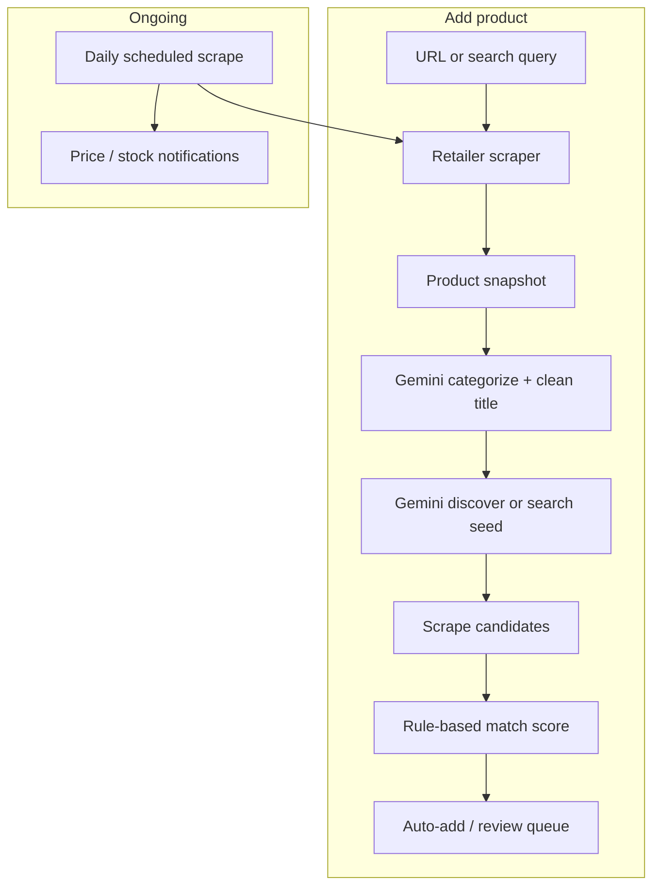
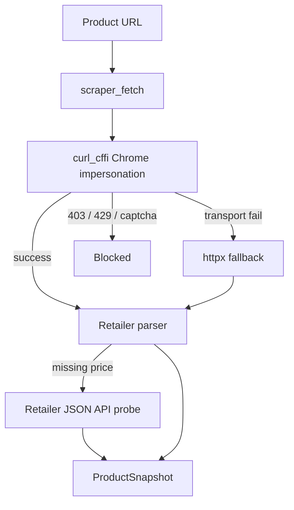
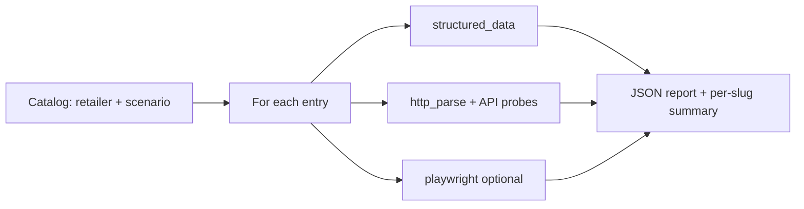
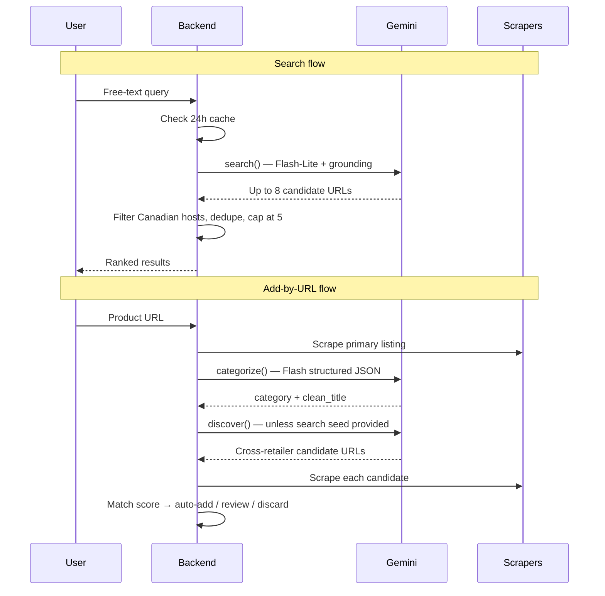
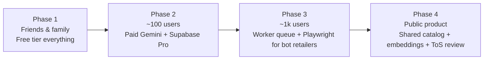

# Engineering Overview

Someday tracks Canadian product prices across retailers. When a user adds a product by URL or search, the backend scrapes retailer pages, enriches the result with AI, discovers the same item at other stores, and refreshes prices on a daily schedule.

This document explains how that works under the hood: scraper architecture, the benchmark harness, the Gemini AI pipeline, key engineering decisions, and how the system could scale beyond the current free-tier prototype.

**Audience:** Engineering contributors. Assumes familiarity with web scraping and LLM APIs, but not this repository.

**Registered today:** 9 native retailers plus a generic fallback (10 registry entries total).

---

## 1. System map

Three principles run through the whole stack:

1. **One scrape contract** — Every retailer exposes `scrape(url) → ProductSnapshot`. Product, notification, and UI code never knows whether data came from JSON-LD, browser-like HTTP, or a headless browser.
2. **Cheapest method first** — Try structured data and browser-like HTTP before reaching for Playwright. Playwright is evaluated in benchmarks but is **not used in production scrapers today**.
3. **LLM proposes, rules verify** — Gemini returns candidate URLs; scrapers extract facts; deterministic scoring decides whether to auto-add a cross-retailer listing.

---

## 2. Scraper architecture

### 2.1 The snapshot contract

Every scraper returns a normalized **ProductSnapshot**:

- Title, brand (best-effort), image URL
- Current price in **CAD cents** and a `currency_seen` field
- In-stock boolean
- Available variant attribute combinations and selected variant (when inferable from URL or page state)
- Breadcrumbs, scrape timestamp, and a small debug payload (no full HTML dumps)

If a page is priced in a non-CAD currency, the listing is rejected. V1 is Canada-only.

### 2.2 Extraction strategies

The system recognizes three measured strategies. In production, almost everything runs on **structured data**; **HTTP parse** is a fallback for bot-protected retailers.

| Strategy | Mechanism | V1 production |
|----------|-----------|---------------|
| **Structured data** | JSON-LD, Open Graph, embedded app state (`__NEXT_DATA__`, Shopify theme meta, etc.) | Default for all shipped retailers |
| **HTTP parse** | `curl_cffi` with Chrome TLS fingerprint → HTML parse; optional retailer JSON API fallback | Best Buy when the HTML product page is blocked |
| **Playwright** | Headless Chromium | Benchmark and evaluation only |

**Blocked detection** treats HTTP 403, 429, and 503, short response bodies, and markers like `cloudflare`, `captcha`, and `access denied` as bot-wall responses.

**Explicit V1 exclusion:** hosted scraping APIs (Firecrawl, ScrapingBee, etc.) are not part of the production plan. They may help with manual fixture capture or retailer research, but the app must not depend on paid credits to operate.

### 2.3 Factory patterns

Rather than building ten fully bespoke scrapers, the codebase uses shared factories with retailer-specific parsers where needed.

| Pattern | Role | Registered retailers |
|---------|------|----------------------|
| **Generic fallback** | JSON-LD / Open Graph only | Any unknown domain |
| **Shopify factory** | JSON-LD + Shopify theme `meta` for variants | `palmisleskate`, `tikiroomskate` |
| **Structured factory** | Shared fetch logic + custom HTML parser | `indigo`, `apple_ca`, `abercrombie` |
| **Bot-protected factory** | `curl_cffi` + custom parser + optional post-validation | `amazon_ca`, `nike_ca` |
| **Custom** | Hand-tuned fallback chain | `bestbuy_ca` |

The **generic** scraper is best-effort and labeled unreliable in the UI. It does **not** participate in cross-retailer discovery because variant normalization is too fragile.

### 2.4 Registered retailers today

| Retailer | Method | Why this approach |
|----------|--------|-------------------|
| **generic** | Structured data | Many small sites expose schema.org; good enough for paste-any-URL |
| **bestbuy_ca** | Structured data → HTTP parse (JSON API) | Fixture HTML parses fine; live product pages are often Akamai-blocked; an internal JSON product API is the production fallback |
| **palmisleskate**, **tikiroomskate** | Structured data (Shopify) | Standard JSON-LD + theme meta; low bot friction on small stores |
| **indigo** | Structured data | Shopify base + ProductGroup JSON-LD for book format / stock |
| **apple_ca** | Structured data | Buy-flow JSON-LD + config grid for storage and color |
| **abercrombie** | Structured data | JSON-LD + embedded price blocks and scoped SKU inventory |
| **amazon_ca** | Structured data on `curl_cffi` HTML | Twister variant matrix; third-party marketplace listings are not supported |
| **nike_ca** | Structured data on `curl_cffi` HTML | `__NEXT_DATA__` parser; color/size matrix; works over HTTP without a browser |

### 2.5 Deferred retailers

These appeared in early product planning but are **not registered** in V1:

| Retailer | Why deferred |
|----------|--------------|
| **sportchek**, **footlocker_ca** | Live HTTP returns Akamai or JS shell pages with no extractable title or price without a real browser |
| **costco_ca** | Some listings sit behind member login; public-only scope adds complexity |
| **canadiantire** | Region and store picker affect pricing |
| **oakley**, **vans_ca** | Bot protection plus lower ROI relative to effort for V1 |
| **eatyourwater** | Active storefront is AUD-only; outside Canada scope |

The common blocker for Sport Chek and Foot Locker is that V1 **intentionally excludes Playwright from production** on the current hosting tier (cold starts, memory pressure on a free Render web service).

### 2.6 Fixture mode and drift detection

**Fixture mode** replays saved HTML or JSON snapshots through the real parser pipeline. No outbound network calls are made. This is the default for local development and CI so engineers and automated agents do not burn retailer bot-protection budgets during iteration.

**Drift detection** is a separate manual health check: scrape a canonical live product URL and compare a **structural fingerprint** (field presence, variant shape, extraction path) to a committed baseline. It compares structure, not price or title text, so normal price movement does not trigger false alarms.

---

## 3. Benchmark harness

### Purpose

Before locking a retailer's `default_strategy` and `fallback_strategies`, run representative URLs through all extraction strategies and record comparable field coverage. Recommendations are **advisory** — a human confirms before they are copied into the registry.

### How a run works

The catalog uses fixture URLs for CI-safe runs. Live runs and optional Playwright are human-triggered.

Each scenario declares which fields are **required**: title, price, stock, image, variants. Standard scenarios per retailer include in-stock, out-of-stock, and multi-variant pages.

### Scoring

For each retailer slug, results are aggregated across scenarios:

1. **Default strategy** — Among strategies that actually ran, pick the one with the highest count of satisfied required fields. Ties break toward faster average runtime, then toward structured_data over http_parse over playwright.
2. **Fallback strategies** — Any other strategy that extracted at least a title or price on any scenario.
3. **Advisory override** — If a retailer has a wired JSON API probe (e.g. Best Buy) and structured_data is the default, http_parse is added as a fallback even when fixture runs skipped the live HTTP lane.

**Caveat:** In fixture mode, http_parse and playwright are often skipped. Summaries can understate live-only fallbacks. Best Buy is the canonical example: fixtures favor structured_data, but production relies on the JSON API when HTML is blocked.

### Next steps for the harness

- Periodic **live benchmark** reports to close the fixture-vs-reality gap
- **CI regression gate** on field scores for retailers touched in a PR
- **Playwright evaluation** for deferred retailers before committing to browser infrastructure
- **Unified retailer health** view merging benchmark summaries and drift fingerprints
- **Auto-suggest registry defaults** from the latest report (still human-reviewed)

---

## 4. AI pipeline (Gemini)

### 4.1 Why an LLM

Scraping alone cannot reliably:

1. Turn vague text ("airpods pro") into canonical product-page URLs across heterogeneous retailers
2. Find the **same variant** of a product at other stores after a URL add
3. Assign products to five fixed dashboard categories and shorten SEO-heavy titles

Rule-based search (per-retailer APIs, sitemap crawling) does not scale across ten-plus site shapes. A grounded LLM with web search is a pragmatic V1 shortcut.

### 4.2 Why Gemini

| Factor | Rationale |
|--------|-----------|
| **Cost** | Generous free tier for Flash and Flash-Lite at prototype scale |
| **Grounded search** | Native Google Search tool — one API call to search the web and return ranked product URLs |
| **Structured JSON** | Categorization uses schema-constrained output without grounding |
| **Latency** | Flash-Lite grounded calls typically respond in ~1–2 seconds |

**Alternatives considered (not primary for V1):**

| Option | Tradeoff |
|--------|----------|
| **OpenAI / Anthropic** | No built-in web grounding equivalent; needs a separate search pipeline; paid at useful volume |
| **SerpAPI + LLM** | Extra vendor, cost, and glue code; still need an LLM to rank and normalize |
| **Firecrawl / hosted scrapers** | Paid or credit-based — conflicts with the $0 operating goal |
| **Per-retailer search APIs** | Incomplete coverage; high ongoing maintenance |

**Important Gemini constraint:** Google Search grounding cannot be combined with controlled JSON schema output on Flash-family models. Search and discovery prompt for JSON in plain text and validate locally. Categorization uses structured JSON output without grounding.

### 4.3 Two-model split

| Model | Use cases | Grounding | Approx. free-tier ceiling (mid-2026; verify at deploy time) |
|-------|-----------|-----------|-------------------------------------------------------------|
| **gemini-2.5-flash** | Categorize + `clean_title` | No | ~1,500 requests/day (non-grounded pool) |
| **gemini-2.5-flash-lite** | Search + discover | Yes (Google Search) | ~1,000 grounded queries/day (separate pool) |
| **gemini-2.5-flash** (grounded) | Not used for search/discover | Yes | ~20/day — too small for real search UX; Lite is mandatory on free tier |

### 4.4 The LlmProvider abstraction

A single interface exposes three methods: `search()`, `discover()`, and `categorize()`. Production wires a Gemini implementation; development and tests use fixture, no-op, or fake providers. Swapping providers does not require rewriting discovery, search, or categorization orchestrators.

### 4.5 Use cases

#### Search

- **Trigger:** Header search or command palette.
- **Flow:** One grounded Flash-Lite call returns up to 8 candidates. The backend filters to Canadian hosts, classifies each URL as a supported retailer or generic fallback, deduplicates by retailer, and caps the UI at **5 results**.
- **Cache:** Normalized query is cached server-side for **24 hours** so repeat searches do not burn quota.
- **Cost control:** When the user clicks **Track**, the chosen URL becomes the primary listing and remaining supported hits are passed as a `discovery_seed`, which **skips the discover LLM call** entirely.

Prompt constraints include: product detail pages only (not category pages), Canadian storefronts, prefer natively supported retailers, at most one URL per retailer, no marketplace or third-party seller pages.

#### Discover (background job)

- **Trigger:** Runs after product creation unless a `discovery_seed` was supplied from search.
- **Flow:** Grounded Flash-Lite returns up to 8 URLs for the same variant at other registered retailers. Each URL is scraped. A **deterministic match score** decides the outcome — the LLM does not score matches.
- **Scoring weights:** title Jaccard similarity 44.4%, brand exact match 22.2%, variant exact match 33.3%.
- **Thresholds:** score ≥ 0.85 auto-add; 0.60–0.849 needs user review; below 0.60 discard.
- **Caps:** maximum 5 listings per product; maximum 4 auto-added non-primary listings. Discovery runs **once per product** (re-add to retry).
- **Skips:** generic primary listings; duplicate retailers or URLs.
- **Failure:** silent — the user keeps their primary listing.

#### Categorize + clean title

- **Trigger:** Product add when category is left on Auto (the default).
- **Flow:** One Flash structured JSON call returns a category slug (one of five fixed values) and an optional `clean_title` (4–80 characters).
- **Title policy:** Adopt `clean_title` only when it is **strictly shorter** than the scraped title. The original scraped title is always preserved on the listing snapshot.
- **Timeout:** 1.5 seconds hard cap. On timeout, quota exhaustion, or invalid output, a heuristic waterfall runs: retailer default → breadcrumb keywords → title/brand keywords → `other`.
- **Manual override:** If the user picks a category in the add flow, no LLM call is made.

Title cleanup adds **zero extra Gemini calls** — it piggybacks on the categorize request.

### 4.6 Reliability and quota guardrails

| Behavior | Detail |
|----------|--------|
| **429 / quota exhausted** | Never retried. Search returns a daily-limit message with URL fallback. Categorize falls back to heuristics. |
| **500 / 502 / 503 / 504** | Up to 3 retries with backoff on grounded calls only |
| **Timeouts** | Search ~20s, discover ~30s, categorize ~1.5s |
| **Empty or refusal responses** | Treated as empty results, not hard errors (e.g. overly broad queries) |
| **CI and unit tests** | Never call the live Gemini API |

### 4.7 What AI does not do

- Scrape product pages (scrapers do that after the LLM returns URLs)
- Decide match confidence (rule-based scorer does)
- Re-run discovery automatically
- Predict prices or generate notifications

---

## 5. Key engineering insights

1. **Measured extraction ladder** — Benchmark before assuming Playwright. Keeps the app viable on a free Render web service.
2. **Fixture-first development** — Same parsers, zero socket I/O in CI. Protects IP reputation with bot-heavy retailers like Best Buy, Amazon, and Nike.
3. **LLM for URLs, rules for truth** — Gemini proposes candidates; scrapers extract facts; Jaccard scoring gates auto-add. Reduces risk from hallucinated listings.
4. **Search seed skips discover** — One grounded call can serve both search and cross-retailer add, conserving the smaller grounded quota pool.
5. **Piggybacked title cleanup** — Better UX without doubling categorize cost.
6. **Pluggable providers** — `LlmProvider`, retailer registry, mail, and FX all follow the same swap-friendly pattern.
7. **Honest brittleness** — `scrape_failing` notifications after repeated failures, drift tooling, and a generic scraper labeled unreliable set correct user expectations.

---

## 6. Free tier today and scaling path

### 6.1 V1 load assumptions

The system is designed for a **primary user plus a handful of friends**, with room for heavy development iteration (~30 manual job triggers per day) and once-daily scheduled scrapes.

| Resource | Free tier (approx.) | V1 typical load | Headroom |
|----------|---------------------|-----------------|----------|
| Gemini Flash (categorize) | ~1,500 RPD | ~1 per product add | Large |
| Gemini Flash-Lite (search + discover) | ~1,000 grounded RPD | 1 search + 1 discover per add; search cached 24h | Comfortable with cache and seeds |
| Render web service | 750 hours/month | Cron wakes + API traffic | Fine at low traffic |
| GitHub Actions (private repo) | 2,000 minutes/month | ~1–3 min/day for cron jobs | Tight at sustained ceiling; public repo removes minute cap |
| Supabase | 500 MB, 50k MAU | Trivial at V1 volume | Fine |
| Resend | 100 emails/day | At most 1 digest per user per day | Fine |

**First bottleneck at scale:** grounded Gemini usage (search + discover), not categorization.

**Second bottleneck:** retailer bot protection (IP rate limits and bans), not cloud provider quotas. Fixture mode mitigates development; production needs respectful scrape cadence and possibly distributed egress.

### 6.2 Scaling by dimension

#### More users and products

| Pressure | Free-tier limit | Scale-up option |
|----------|-----------------|-----------------|
| Grounded Gemini calls | ~1,000 RPD (Lite) | **Paid Gemini API** — higher RPD and pay-per-token; or reduce discover frequency |
| Categorize calls | ~1,500 RPD (Flash) | Paid tier; or shift more products to heuristic categorization |
| Daily scrape volume | Single server IP, cold starts | **Paid Render** (no sleep), dedicated worker queue, scrape sharding by retailer |
| Database | 500 MB on free Supabase | **Supabase Pro** |
| Email digests | 100/day on Resend | **Resend paid tier** |

Tactics before paying:

- Extend search cache TTL
- Make periodic re-discovery opt-in rather than automatic on every add
- **Shared product catalog** — deduplicate scrapes across users scraping the same canonical URL (architectural shift)

#### More retailers

| Pressure | Scale-up option |
|----------|-----------------|
| Bot-blocked sites (Sport Chek, Foot Locker) | **Playwright on dedicated compute** (background worker, not serverless); or residential proxy + `curl_cffi` |
| Parser maintenance | Continue shared factory pattern (Shopify, structured, bot-protected) |
| Onboarding speed | **Firecrawl or Bright Data for fixture recording only** — research tool, not production dependency |

#### More sophisticated scrapers

| Capability | When needed | Paid / infra option |
|------------|-------------|----------------------|
| Playwright in production | Benchmark proves HTTP insufficient | Dedicated worker on Render; **Browserless.io** or **Apify** actors |
| Anti-bot egress | IP bans on daily scrape | **Rotating proxy services** (per-GB cost) |
| Hosted scrape APIs | Team prioritizes speed over $0 | **Firecrawl**, **ScrapingBee** — monthly credits; fast for onboarding, risky as sole production path |
| Better cross-retailer matching | Jaccard too brittle at scale | Embedding API + vector store; image perceptual hash for variant disambiguation |

#### More sophisticated AI

| Feature | Scale trigger | Paid path |
|---------|---------------|-----------|
| Confidence-based categorization | Mislabels annoy users | Same Gemini with richer prompts + user-confirm UI |
| Periodic re-discovery | Stale cross-retailer data | Budget N grounded calls per product per month |
| Semantic product matching | Variant ambiguity | Embeddings via Gemini or open models + **pgvector** or Pinecone |
| Multi-provider LLM | Gemini quota or latency shifts | **OpenAI + web search** or **Perplexity API** for search; keep `LlmProvider` swap |
| MSRP / deal context | User trust in "good deal" signals | Separate data source or grounded lookup — watch hallucination risk |

### 6.3 Suggested scaling phases

**Phase 1 — Today:** Free infrastructure; fixture development; Flash-Lite for all grounded calls; HTTP-only production scrapers.

**Phase 2 — ~100 users:** Paid Gemini; Supabase Pro; paid Render to eliminate cold starts; respectful per-retailer rate limits on scrape.

**Phase 3 — ~1,000 users / 10,000 listings:** Shared scrape cache per canonical URL; background worker queue; Playwright for two or three bot retailers on dedicated compute; proxy pool for Amazon, Best Buy, Nike if IP bans appear.

**Phase 4 — Public launch:** Terms-of-service review for scraping; optional hosted scrape for retailer onboarding only; embedding-based matching; evaluate alternate search APIs if Gemini grounding economics change.

---

## 7. If we had more time

**Scrapers**

- Ship deferred retailers after Playwright benchmark evaluation
- Region-aware parsers (Canadian Tire, Costco public pages)
- Self-recording fixtures when drift is detected
- CI benchmark regression gate
- Auto-disable a retailer scraper after repeated drift failures

**AI**

- Categorization with confidence score and user confirm above a threshold
- Periodic re-discovery for existing products
- Image perceptual hash in match scoring
- Opt-in worker to backfill cleaned titles for legacy products
- "Cheaper elsewhere" indicator once matching is reliable at scale
